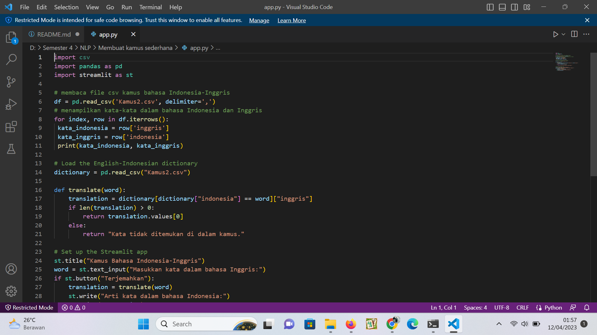
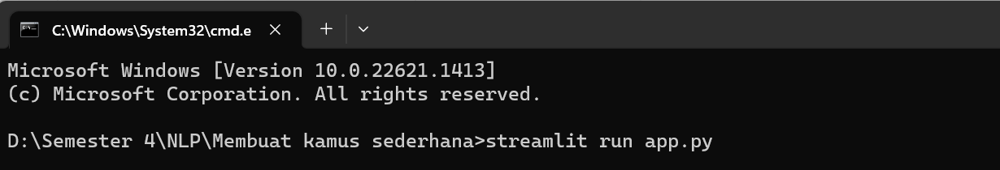
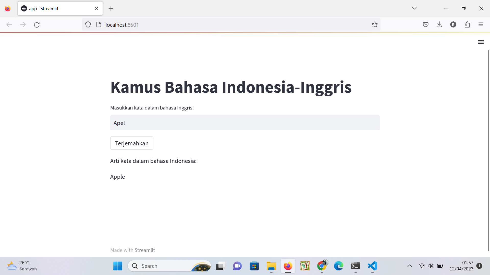

### Nama
1. Rafitajudin

<br/>
<br/>

## Gambaran "Membuat kamus dengan python menggunakan framework streamlit"

Streamlit adalah sebuah framework open-source yang digunakan untuk membuat aplikasi web interaktif dengan mudah menggunakan bahasa pemrograman Python. Dengan Streamlit, pengembang dapat membuat aplikasi web yang interaktif dengan cepat dan mudah, tanpa perlu memiliki pengetahuan khusus tentang pengembangan web.

Streamlit memungkinkan pengembang untuk membangun antarmuka pengguna dengan mudah menggunakan kode Python biasa, sehingga pengembang dapat fokus pada logika aplikasi daripada hal-hal seperti HTML, CSS, atau JavaScript. Streamlit juga menyediakan fitur-fitur seperti tampilan data yang dinamis, plot interaktif, dan kemampuan untuk memuat dan menampilkan model mesin pembelajaran dan data analisis.

Streamlit menjadi salah satu pilihan populer di kalangan pengembang Python untuk membangun aplikasi web, khususnya yang berhubungan dengan data science dan machine learning.
## Dependencies

 - Streamlit Version 1.18.1

## Requirements and installation

In order to work, Attendance Using Face Recognition project is based on these following modules:

- csv
- pandas 
- Streamlit

To install library, simply:

```bash
> pip install pandas
> pip install streamlit
```

## Menjalankan Streamlit
Buka CMD, pastikan sudah didalam foldel anda menyimpan app.py:

```bash
> streamlit run app.py
```

Buat Code python dengan VSCode.
<p align="center">
    
    <br>
 </p>
 
Buka CMD lalu tuliskan perintah.
<p align="center">
    
    <br>
 </p>
 
Tampilan Halaman Localhost.
<p align="center">
    
    <br>
 </p>

## Algorithms

-Python
